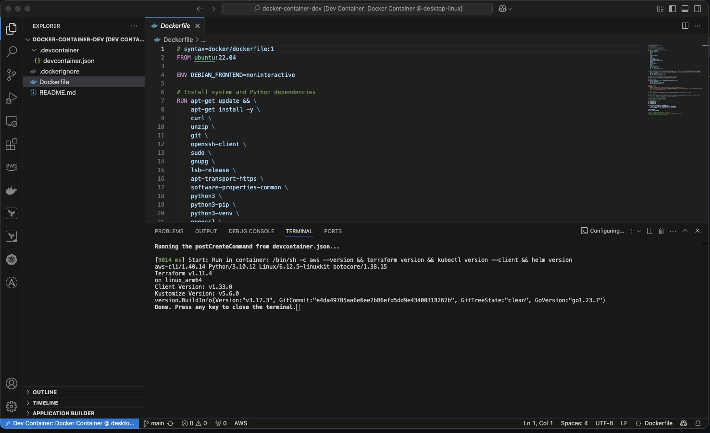

# Docker Dev Container (Platforms)

This repo provides a simple Docker-based development environment for any team to use with Visual Studio Code Dev Containers.



## Use Case

The idea is everyone in your team uses this container file, this sorts a few issues;

- Everyones using a common toolset.
- Applications are installed automatically.
- Local machine only needs VSC, Git and Docker to run the container.
- A quick and easy, repeatable build that takes minutes not hours to setup.

I really like using this for deploying Terraform code, no matter what machine im on as long as I have the pre-reqs installed I can start a container without having to worry about all the installations for AWS CLI and Terraform etc.

In previous roles, I had to build developer laptops manually so created complex powershell scripts with multiple pathings, this is sortve an evolution of that in the cloud world.

## Development Ideas

You could expand the code for things such as;

- Use in a GitActions style CICD setup if you wanted to ensure both your devs and runners are using the same containers.
- Sub-module / Sub-tree the docker repo in your application repos so when you clone the application repo it pulls down the container also, meaning you could span the container across multiple repos automatically.
- Modify the .gitignore file, as its likely someone will accidentally commit files into the container instead of thier repo (as suggested above re trees/submodules).
- Modify the .dockerignore file, as above.
- Add/Remove any applications you need.

## 🚀 Features

- AWS CLI + awsume + boto3
- Terraform
- Ansible
- kubectl, eksctl, helm
- Docker CLI
- Python, pip, venv
- OpenSSL for cert management

It also installs common VSC extentions for the above such as;

- Terraform
- Ansible
- Docker
- Python
- AKS
- EKS
- AWS Toolkit

## 🔧 Getting Started

### Prerequisites

A computer of some form, upto you what it is but if using Windows, use the below - if using Linux/MacOS then it depends on your distro so I'll leave that to you, the container that spins up is Ubuntu.

- [Docker Desktop](https://www.docker.com/products/docker-desktop)
- [Visual Studio Code](https://code.visualstudio.com/)
- [Dev Containers Extension](https://marketplace.visualstudio.com/items?itemName=ms-vscode-remote.remote-containers)

Run everything below from PowerShell until VSC opens.

1. **Install Visual Studio Code, Git and Docker:**
   ```bash
   winget install --id Microsoft.VisualStudioCode
   winget install --id Docker.DockerDesktop
   winget install --id Git.Git
   
2. **Install Visual Studio Code Extention for Dev Containers:**
   ```bash  
   code --install-extension ms-vscode-remote.remote-containers

### Usage

You can either load VSC up and clone https://github.com/chris-fison/docker-container-dev.git or use the fancy way below:

1. Clone the repo:
   ```bash
   git clone https://github.com/chris-fison/docker-container-dev.git
   cd docker-container-dev
   git checkout main
   code .
   ```

2. Once VS Code opens:
   - Press `F1` → _Dev Containers: Reopen in Container_
   - Or wait for the auto prompt

3. Start working with the unified toolset.

## 🔄 Keeping Up-to-Date

The container rebuilds on launch if the Dockerfile or config changes. To force a rebuild manually:
```bash
Dev Containers: Rebuild Container
```

I'd suggest building it once a week, remove the container and the image from Docker just so it updates your local image.

Cheers!


